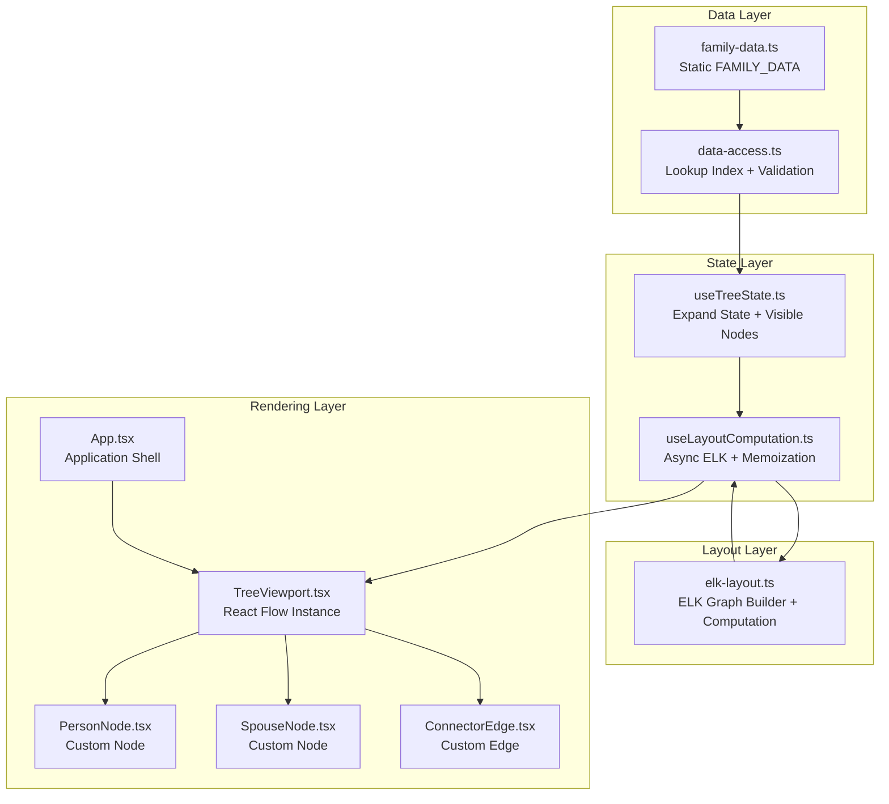
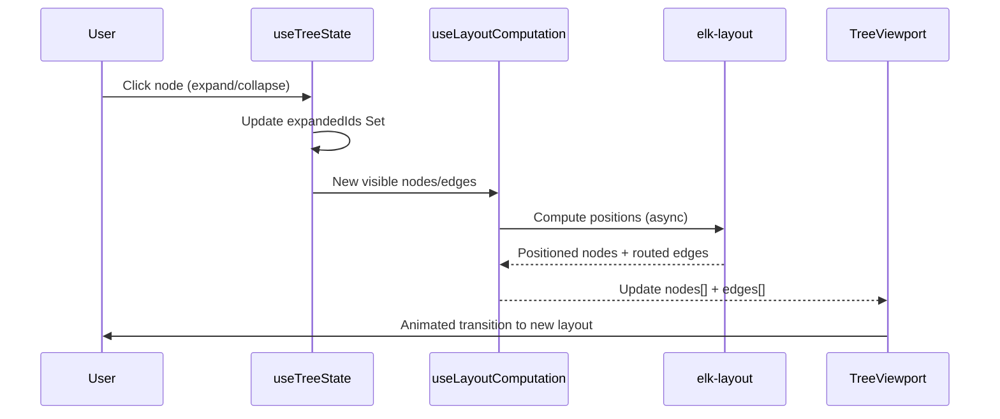

# Design Document: Family Tree Rebuild

## Overview

This design describes a complete architectural rebuild of an existing Arabic interactive family tree application. The current implementation uses plain HTML/CSS/JavaScript with manual SVG connectors, DOM-based state, and imperative pan/zoom logic. The rebuild migrates to a modern React/TypeScript stack while preserving all existing functionality and the full dataset of 86 people across 6+ generations.

### Key Design Decisions

1. **React Flow as the graph engine** — React Flow (@xyflow/react) provides built-in viewport management (pan, zoom, touch gestures, viewport culling) eliminating the need for custom pan/zoom code. Custom nodes render person and spouse cards.

2. **ELK.js for layout computation** — The ELK layered algorithm handles hierarchical positioning with RTL sibling ordering, automatic spacing, and orthogonal edge routing. Layout is computed as a pure async function decoupled from rendering.

3. **Progressive disclosure via expand state** — Only visible branches exist as React Flow nodes. The expand state (a Set of person IDs) drives which nodes/edges are generated for layout computation.

4. **Motion for React for animations** — AnimatePresence handles mount/unmount transitions for nodes. Layout animations handle position changes when the tree reflows after expand/collapse.

5. **Data layer isolation** — A dedicated data-access module builds the lookup index and validates references at startup. Layout and rendering modules consume typed interfaces, making future API migration a single-module change.

### Technology Stack

| Layer | Technology | Purpose |
|-------|-----------|---------|
| Build | Vite | Fast dev server, production bundling |
| Language | TypeScript (strict) | Type safety, noImplicitAny |
| UI Framework | React 18+ | Component model, hooks |
| Styling | Tailwind CSS | Utility-first, monochrome design tokens |
| UI Components | shadcn/ui | Buttons, tooltips, dialogs |
| Graph Engine | @xyflow/react | Node rendering, viewport, edges |
| Layout | elkjs | Hierarchical auto-layout |
| Animation | motion/react | Enter/exit/layout transitions |
| Font | IBM Plex Sans Arabic | Primary Arabic typeface |

## Architecture

### High-Level Architecture Diagram



### Data Flow



### Module Boundaries

Each module has a single responsibility and communicates through defined TypeScript interfaces:

- **Data Layer**: Owns the raw data, builds indices, validates references. Exports `DataAccess` interface.
- **Layout Layer**: Converts visible tree state into ELK graph, computes positions. Exports `LayoutResult` interface.
- **State Layer**: Manages which nodes are expanded, derives visible nodes/edges from data + expand state. Exports `useTreeState` and `useLayoutComputation` hooks.
- **Rendering Layer**: Presents the positioned graph using React Flow with custom nodes and edges. Consumes positioned data, never computes layout.

## Components and Interfaces

### Directory Structure

```
src/
├── main.tsx                    # Vite entry point
├── App.tsx                     # Application shell (header + toolbar + viewport)
├── components/
│   ├── TreeViewport.tsx        # React Flow wrapper with viewport config
│   ├── PersonNode.tsx          # Custom React Flow node for family members
│   ├── SpouseNode.tsx          # Custom React Flow node for spouses
│   ├── ConnectorEdge.tsx       # Custom React Flow edge (orthogonal, animated)
│   ├── Toolbar.tsx             # Tree control buttons
│   ├── Header.tsx              # Sticky header with title
│   ├── LoadingState.tsx        # Loading indicator
│   └── ErrorState.tsx          # Error/empty state display
├── hooks/
│   ├── useTreeState.ts         # Expand state management + visible node derivation
│   ├── useLayoutComputation.ts # Async ELK layout with memoization
│   ├── useReducedMotion.ts     # prefers-reduced-motion detection
│   └── useTreeKeyboard.ts     # Keyboard navigation (arrows, Enter, Space)
├── data/
│   ├── family-data.ts          # Raw FAMILY_DATA constant (migrated from data.js)
│   └── data-access.ts          # Lookup index, validation, public API
├── layout/
│   └── elk-layout.ts           # ELK graph construction + computation
├── types/
│   ├── family.ts               # Person, Spouse, FamilyData interfaces
│   ├── tree-state.ts           # ExpandState, VisibleNode, VisibleEdge types
│   └── layout.ts               # LayoutResult, PositionedNode types
├── utils/
│   ├── constants.ts            # Design tokens, spacing, timing values
│   └── linked-spouse.ts        # Linked spouse resolution + canonical ownership
├── styles/
│   └── globals.css             # Tailwind directives + IBM Plex Sans Arabic import
└── index.html                  # Vite HTML entry (lang="ar" dir="rtl")
```

### Component Specifications

#### App.tsx (Application Shell)

```typescript
interface AppProps {}

// Responsibilities:
// - Renders Header, Toolbar, TreeViewport in a flex column layout
// - Provides tree state context to children
// - Handles top-level error boundary
```

#### TreeViewport.tsx

```typescript
interface TreeViewportProps {
  nodes: Node<PersonNodeData | SpouseNodeData>[];
  edges: Edge[];
  onNodeClick: (personId: string) => void;
}

// Responsibilities:
// - Wraps ReactFlow component with custom node/edge types
// - Configures viewport (zoom range 0.3-3x, pan on drag)
// - Sets RTL-appropriate default viewport position
// - Passes fitView, zoomIn, zoomOut controls to Toolbar via ref/callback
```

#### PersonNode.tsx

```typescript
interface PersonNodeData {
  personId: string;
  name: string;
  relation: string;
  notes: string;
  gender: 'male' | 'female';
  isExpanded: boolean;
  isExpandable: boolean;
  isRoot: boolean;
}

// Responsibilities:
// - Renders person card with name (bold, 2-line clamp), secondary text
// - Shows chevron indicator for expandable nodes (rotates when expanded)
// - Handles click/keyboard to trigger expand/collapse
// - Applies interaction states (hover shadow, press scale, focus outline)
// - Renders as non-interactive element for leaf nodes
// - Wrapped in motion.div for enter/exit animations
```

#### SpouseNode.tsx

```typescript
interface SpouseNodeData {
  spouseId: string;
  name: string;
  label: string;
  type: 'external' | 'linked';
  isLinked: boolean;
  isHidden: boolean; // true for unknown names
}

// Responsibilities:
// - Renders spouse card with dashed border
// - Shows spouse name + label
// - Displays link indicator for linked spouses
// - Hidden (not rendered) when name is unknown — children connect directly to parent
```

#### ConnectorEdge.tsx

```typescript
interface ConnectorEdgeData {
  animated: boolean;
}

// Responsibilities:
// - Renders orthogonal (step) edge with rounded corners
// - Black stroke (#000), 2.5px width, round linecap
// - No arrowheads
// - Fade-in animation on mount (400ms)
// - Fade-out on unmount (220ms)
// - aria-hidden="true"
```

### Key Hooks

#### useTreeState

```typescript
interface TreeState {
  expandedIds: Set<string>;
  visibleNodes: VisibleNode[];
  visibleEdges: VisibleEdge[];
  expand: (personId: string) => void;
  collapse: (personId: string) => void;
  collapseAll: () => void;
  toggleNode: (personId: string) => void;
}

function useTreeState(dataAccess: DataAccess): TreeState;
```

This hook:
- Maintains the `expandedIds` set in React state
- Derives visible nodes/edges by traversing from root, only descending into expanded nodes
- Maintains a visited set to prevent infinite loops from linked spouses
- Assigns canonical ownership of shared children (first parent in top-down traversal)

#### useLayoutComputation

```typescript
interface LayoutResult {
  nodes: Node<PersonNodeData | SpouseNodeData>[];
  edges: Edge[];
  isComputing: boolean;
  error: string | null;
}

function useLayoutComputation(
  visibleNodes: VisibleNode[],
  visibleEdges: VisibleEdge[]
): LayoutResult;
```

This hook:
- Converts visible nodes/edges to ELK graph format
- Calls ELK layout asynchronously
- Memoizes results based on expand state fingerprint
- Returns positioned React Flow nodes/edges
- Handles layout errors gracefully (retains last valid layout)

## Data Models

### TypeScript Interfaces

```typescript
// === Core Family Data Types ===

interface Person {
  id: string;
  name: string;
  gender: 'male' | 'female';
  relation: string;
  fatherId: string | null;
  motherId: string | null;
  spouses: Spouse[];
  notes: string;
}

interface Spouse {
  id: string;
  type: 'external' | 'linked';
  name: string;          // Display name (for external) or empty (for linked)
  label: string;         // e.g., "الزوجة الأولى"
  childrenIds: string[];
  personId?: string;     // Only for type: "linked" — references Person.id
}

interface FamilyData {
  rootPersonId: string;
  people: Person[];
}

// === Data Access Layer ===

interface DataAccess {
  getPerson(id: string): Person | null;
  getRoot(): Person | null;
  getSpouseDisplayName(spouse: Spouse): string;
  isSpouseNameUnknown(spouse: Spouse): boolean;
  getSpouseChildren(spouse: Spouse): Person[];
  personHasExpandableBranch(person: Person): boolean;
  getInitial(name: string): string;
  readonly validationIssues: ValidationIssue[];
  readonly isRootValid: boolean;
}

interface ValidationIssue {
  type: 'duplicate_id' | 'missing_reference' | 'invalid_root' | 'missing_id';
  message: string;
  personId?: string;
  referencedId?: string;
}

// === Tree State Types ===

interface VisibleNode {
  id: string;              // Unique node key (personId or spouseId compound key)
  type: 'person' | 'spouse';
  personId: string;        // The person this node represents
  spouseId?: string;       // For spouse nodes
  parentNodeId: string | null;  // Parent in the visual hierarchy
  data: PersonNodeData | SpouseNodeData;
}

interface VisibleEdge {
  id: string;
  source: string;          // Source node ID
  target: string;          // Target node ID
}

// === Layout Types ===

interface PositionedNode extends VisibleNode {
  position: { x: number; y: number };
  width: number;
  height: number;
}

interface LayoutResult {
  nodes: PositionedNode[];
  edges: VisibleEdge[];
  computationTimeMs: number;
}

// === ELK Configuration ===

interface ElkLayoutOptions {
  algorithm: 'layered';
  direction: 'DOWN';
  'elk.layered.spacing.nodeNodeBetweenLayers': string; // "40" vertical
  'elk.spacing.nodeNode': string;                       // "20" horizontal
  'elk.edgeRouting': 'ORTHOGONAL';
  'elk.layered.nodePlacement.strategy': 'NETWORK_SIMPLEX';
  'elk.direction': 'RIGHT';  // RTL: siblings ordered right-to-left
}
```

### ELK Graph Construction

The layout module transforms visible nodes/edges into an ELK graph:

```typescript
interface ElkNode {
  id: string;
  width: number;
  height: number;
  children?: ElkNode[];
  layoutOptions?: Record<string, string>;
}

interface ElkEdge {
  id: string;
  sources: string[];
  targets: string[];
}

interface ElkGraph {
  id: string;
  layoutOptions: ElkLayoutOptions;
  children: ElkNode[];
  edges: ElkEdge[];
}
```

Node dimensions are determined by type:
- **PersonNode**: width 140px (desktop) / 120px (mobile), height ~72px
- **SpouseNode**: width 126px (desktop) / 106px (mobile), height ~60px

### State Management Strategy

The application uses a minimal state approach with React hooks:

1. **Expand State** (`useState<Set<string>>`) — Set of expanded person IDs
2. **Derived State** — Visible nodes/edges computed via `useMemo` from expand state + data
3. **Layout State** — Positioned nodes from async ELK computation with `useEffect`
4. **Viewport State** — Managed internally by React Flow (accessible via `useReactFlow()`)

No external state library (Redux, Zustand) is needed — the data is static and the only user-driven state is which nodes are expanded.

### Linked Spouse Resolution Strategy

The linked spouse problem (two people in the tree married to each other) is solved by:

1. **Canonical ownership**: During top-down traversal from root, the first parent encountered "owns" shared children. A visited-persons set prevents re-expansion.
2. **Display resolution**: Linked spouse nodes display the referenced person's name resolved from the lookup index.
3. **Visual indicator**: Linked spouse nodes show a small link icon badge indicating the person exists elsewhere in the tree.
4. **No duplication**: Children appear only under their canonical parent's spouse entry. The non-canonical parent's linked spouse node shows a visual cue but no children below it.

### Data Validation Pipeline

At startup, the data-access module runs validation in this order:

1. Check `people` array exists and is valid
2. Build lookup index (Map<string, Person>), flagging duplicate IDs
3. Validate all `fatherId`/`motherId` references exist
4. Validate all `childrenIds` references exist
5. Validate all linked spouse `personId` references exist
6. Validate `rootPersonId` exists

Issues are collected as `ValidationIssue[]` objects and logged as a console group. The application renders normally if root is valid, skipping broken references. If root is invalid, an error state is displayed.

## Correctness Properties

*A property is a characteristic or behavior that should hold true across all valid executions of a system — essentially, a formal statement about what the system should do. Properties serve as the bridge between human-readable specifications and machine-verifiable correctness guarantees.*

### Property 1: Lookup Index Round-Trip

*For any* valid people array, building the lookup index and then querying each person's ID should return the exact same person object that was inserted.

**Validates: Requirements 3.1**

### Property 2: Duplicate ID Handling

*For any* people array containing duplicate person IDs, the lookup index should map the duplicated ID to the last occurrence of that person object in the array, and validation should report each duplicate.

**Validates: Requirements 3.7, 14.1**

### Property 3: Reference Integrity Validation

*For any* family data, validation should detect and report every non-null fatherId, motherId, childrenId, and linked spouse personId that does not reference an existing person ID in the people array, and should separately flag an invalid rootPersonId.

**Validates: Requirements 14.2, 14.3, 14.4**

### Property 4: Broken References Excluded from Visible Tree

*For any* family data containing broken references (childrenIds pointing to non-existent people), the visible tree should include all persons with valid references and exclude all nodes whose IDs are referenced but don't exist in the lookup index.

**Validates: Requirements 3.6, 14.6**

### Property 5: Spouse Display Name Resolution

*For any* spouse entry, if the type is "external" then getSpouseDisplayName should return the spouse's name field; if the type is "linked" with a valid personId, it should return the referenced person's name from the lookup index.

**Validates: Requirements 3.5, 5.7, 6.1**

### Property 6: Unknown Spouse Exclusion

*For any* spouse whose resolved display name matches the unknown patterns ("غير معروفة", "غير معروف", "غير معروف/ة"), that spouse node should be excluded from visible nodes and its children should have edges connecting directly from the parent person node.

**Validates: Requirements 5.6, 7.5**

### Property 7: Tree Structure Matches Data

*For any* expanded person, the generated visible nodes should include spouse nodes in the same order as the person's spouses array, and each spouse node's children should correspond exactly to that spouse's childrenIds resolved from the lookup, preserving array order.

**Validates: Requirements 3.3, 3.4, 5.1, 5.2**

### Property 8: Expand Reveals One Level

*For any* expandable person (having at least one spouse with non-empty childrenIds), expanding that person should add exactly its spouse nodes and their direct children to the visible node set — no deeper descendants.

**Validates: Requirements 4.2**

### Property 9: Collapse Removes All Descendants

*For any* expanded person, collapsing that person should remove its ID from the expanded set and remove all of its descendants (spouse nodes, children, grandchildren, etc.) from the visible node set.

**Validates: Requirements 4.3**

### Property 10: Canonical Ownership of Shared Children

*For any* pair of linked spouses sharing the same childrenIds, the children should appear as visible nodes only under the canonical parent (the first parent encountered in top-down traversal from root), and never be duplicated under both parents simultaneously.

**Validates: Requirements 6.2, 6.5**

### Property 11: No Infinite Traversal Loops

*For any* tree containing linked spouses (creating potential cycles), the tree traversal algorithm should visit each person ID at most once and the resulting visible node set should be finite.

**Validates: Requirements 6.3**

### Property 12: Visible Nodes Equal Reachable Through Expanded Paths

*For any* expand state (set of expanded person IDs), the visible nodes should include exactly the root node plus all nodes reachable by traversing from root through only expanded person IDs — no more, no fewer.

**Validates: Requirements 16.1**

### Property 13: Leaf Node Detection

*For any* person in the data, if that person has no spouses with non-empty childrenIds (personHasExpandableBranch returns false), then the PersonNodeData should have isExpandable=false.

**Validates: Requirements 12.6, 19.4**

### Property 14: Secondary Text Selection

*For any* person, if their notes field is a non-empty string after trimming, the secondary text should equal their notes; otherwise the secondary text should equal their relation field.

**Validates: Requirements 7.2**

### Property 15: Name Initial Fallback

*For any* string that is empty, null, undefined, or composed entirely of whitespace, getInitial should return "؟". For any non-empty trimmed string, it should return the first character.

**Validates: Requirements 7.8**

### Property 16: RTL Sibling Ordering

*For any* set of sibling nodes (children of the same parent) in a computed layout, their x-coordinates should be in descending order (rightmost sibling first), reflecting right-to-left reading direction.

**Validates: Requirements 2.4, 8.4**

### Property 17: Non-Overlap Spacing Invariant

*For any* computed layout, no two node bounding boxes should have less than 20px horizontal clearance or less than 40px vertical clearance between adjacent layers, regardless of the number of children or tree depth.

**Validates: Requirements 8.2, 8.5, 8.6, 20.1, 20.2**

### Property 18: Zero-Children Spouse Has No Child Edges

*For any* spouse node whose corresponding spouse entry has an empty childrenIds array, the visible edge set should contain no edges with that spouse node as a source.

**Validates: Requirements 20.5**

### Property 19: aria-label Correctness

*For any* person node, if the person is expandable, the aria-label should contain the person's name and an expand instruction; if the person is a leaf node, the aria-label should contain only the person's name.

**Validates: Requirements 15.3**

### Property 20: Layout Memoization

*For any* expand state, calling the layout computation function twice with the same set of visible nodes and edges should return the cached result without triggering a new ELK computation.

**Validates: Requirements 16.3**

## Error Handling

### Error Categories and Strategies

| Error Type | Detection | Response | User Impact |
|-----------|-----------|----------|-------------|
| Invalid root person | Startup validation | Show full-page Arabic error message | Cannot use app |
| Broken child reference | Startup validation | Log warning, omit node from tree | Minor — some nodes missing |
| Duplicate person ID | Startup validation | Log warning, use last occurrence | None visible |
| ELK layout failure | Async computation catch | Retain previous layout, show inline error | Temporary stale view |
| Data load/parse failure | Try-catch on import | Show error state with retry button | Cannot use app |
| Linked spouse invalid ref | Startup validation | Log warning, show fallback name | Minor visual |
| Expand during collapse | State check | Cancel pending animation, apply new state | None — seamless |

### Error State Components

1. **Full-page error** (data load failure, invalid root): Centered Arabic message with retry button. Uses shadcn/ui Alert component.
2. **Inline error** (layout failure during expand): Small toast-like message near the affected node area. Auto-dismisses after 5 seconds.
3. **Console warnings** (validation issues): Grouped under collapsible console group with count header. Development-time feedback only.

### Graceful Degradation Rules

- A single broken reference never crashes the entire tree — only the affected branch is omitted.
- If ELK fails, the last valid layout persists. The user can still interact with already-rendered nodes.
- If a linked spouse references a non-existent person, the spouse node renders with a fallback label ("غير معروف/ة") rather than disappearing.
- Animation failures (if Motion throws) are caught and the state change is applied instantly without animation.

## Testing Strategy

### Dual Testing Approach

The testing strategy combines property-based tests for universal correctness guarantees with unit tests for specific examples and integration tests for full-stack behavior.

### Property-Based Testing

**Library:** [fast-check](https://github.com/dubzzz/fast-check) (TypeScript-native PBT library)

**Configuration:**
- Minimum 100 iterations per property test
- Each test tagged with: `Feature: family-tree-rebuild, Property {N}: {title}`
- Custom arbitraries for generating valid `Person`, `Spouse`, and `FamilyData` structures
- Generators include edge cases: empty names, duplicate IDs, broken references, linked spouse cycles

**Coverage:**
- Properties 1–20 from the Correctness Properties section
- Each property maps to a single property-based test
- Generators produce diverse family structures (varying depth, width, spouse count, linked spouses)

### Unit Tests (Example-Based)

**Framework:** Vitest (bundled with Vite)

**Focus areas:**
- Component rendering snapshots (PersonNode, SpouseNode, ConnectorEdge)
- Toolbar button click handlers
- Reduced motion hook behavior
- Animation configuration values (durations, easing)
- Responsive breakpoint behavior
- Specific data from the real FAMILY_DATA (e.g., p001 root rendering, p021/p030 linked spouse pair)

### Integration Tests

**Framework:** Vitest + Testing Library

**Focus areas:**
- Full expand/collapse cycle with React Flow rendering
- Keyboard navigation flow (Tab, arrows, Enter/Space)
- Layout computation timing benchmarks (<200ms for ≤50 nodes, <500ms for 50-86)
- Touch/mouse interaction delegates to React Flow
- Error boundary behavior on data load failure

### Test Organization

```
src/
├── __tests__/
│   ├── properties/
│   │   ├── data-access.property.test.ts   # Properties 1-6, 13-15
│   │   ├── tree-state.property.test.ts    # Properties 7-12
│   │   ├── layout.property.test.ts        # Properties 16-18, 20
│   │   └── accessibility.property.test.ts # Property 19
│   ├── unit/
│   │   ├── PersonNode.test.tsx
│   │   ├── SpouseNode.test.tsx
│   │   ├── Toolbar.test.tsx
│   │   ├── data-access.test.ts
│   │   └── elk-layout.test.ts
│   └── integration/
│       ├── tree-expand-collapse.test.tsx
│       ├── keyboard-navigation.test.tsx
│       └── performance.test.ts
```

### Custom Generators for Property Tests

```typescript
// Arbitrary for valid Person
const personArb = fc.record({
  id: fc.stringMatching(/^p\d{3,4}$/),
  name: fc.oneof(fc.string({ minLength: 1 }), fc.constant("")),
  gender: fc.constantFrom("male", "female"),
  relation: fc.string(),
  fatherId: fc.option(fc.stringMatching(/^p\d{3,4}$/), { nil: null }),
  motherId: fc.option(fc.stringMatching(/^p\d{3,4}$/), { nil: null }),
  spouses: fc.array(spouseArb, { maxLength: 3 }),
  notes: fc.string()
});

// Arbitrary for valid FamilyData with consistent references
const familyDataArb = fc.gen().map(/* builds a structurally valid tree */);
```

